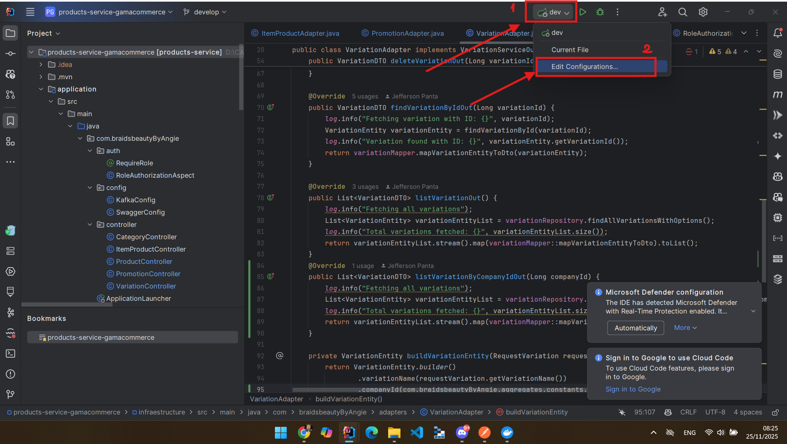
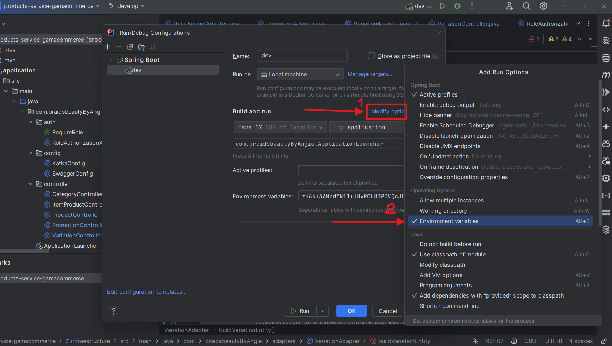
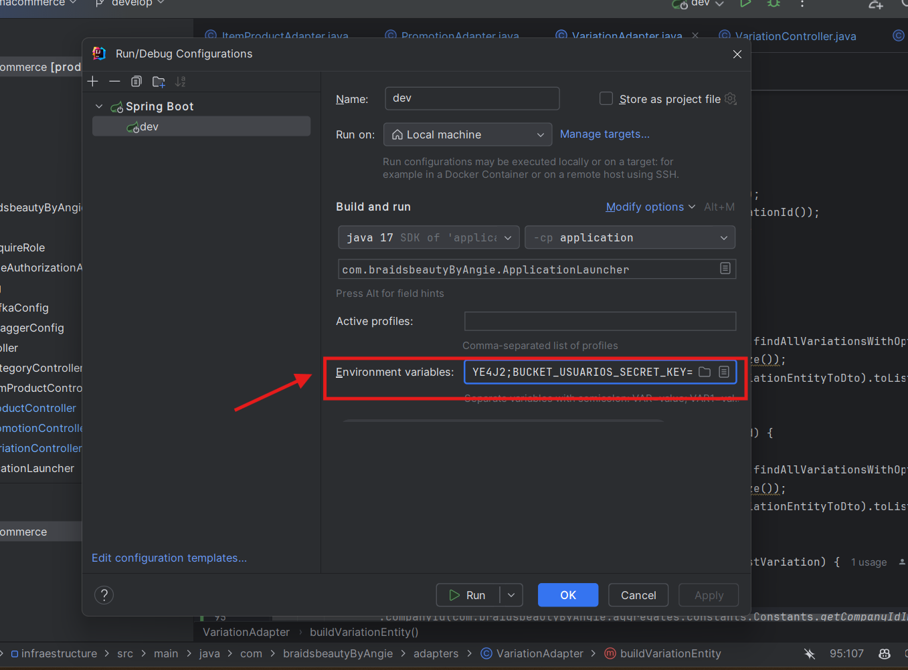
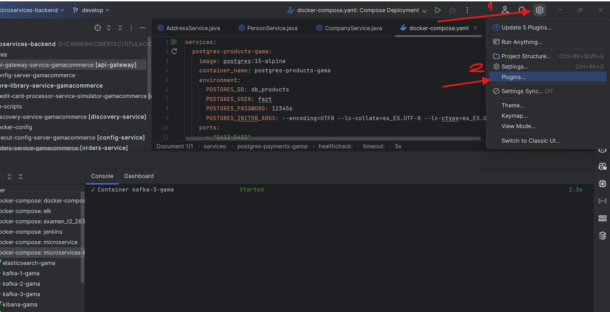
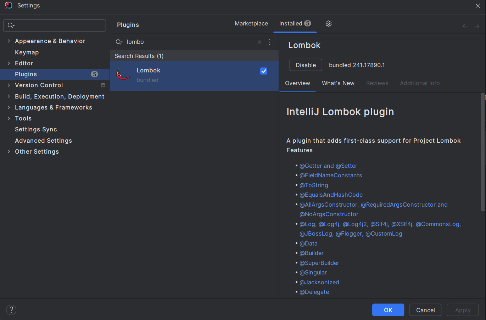
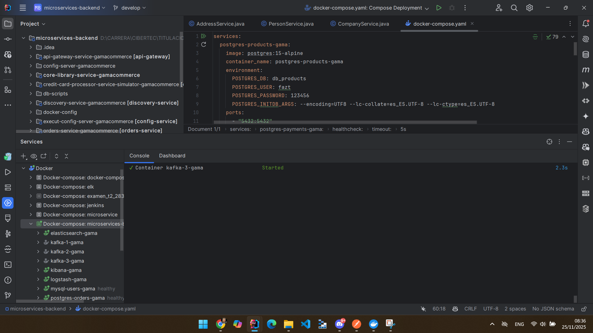
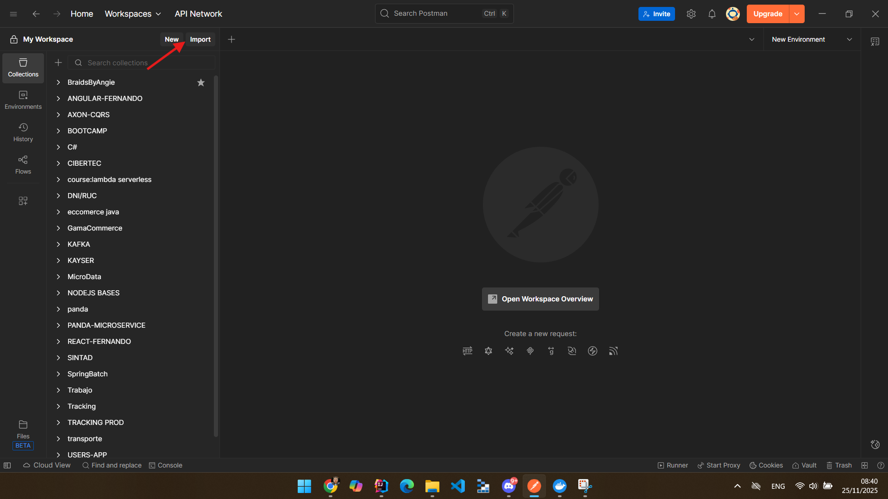

# 🛒 GamaCommerce - Microservices Architecture

[](https://spring.io/projects/spring-boot)
[](https://www.oracle.com/java/technologies/javase/jdk17-archive-downloads.html)
[](https://maven.apache.org/)
[](https://www.docker.com/)
[](LICENSE)

> Sistema de microservicios empresarial para e-commerce construido con Spring Boot 3.x, Java 17 y arquitectura cloud-native.

---

## 📑 Tabla de Contenidos

- [Acerca del Proyecto](#-acerca-del-proyecto)
- [Arquitectura](#-arquitectura)
- [Requisitos del Sistema](#️-requisitos-del-sistema)
- [Instalación](#-instalación)
- [Configuración](#️-configuración)
- [Ejecución](#-ejecución)
- [Pruebas con Postman](#-pruebas-con-postman)
- [Monitoreo y Observabilidad](#-monitoreo-y-observabilidad)
- [Solución de Problemas](#-solución-de-problemas)
- [Contribución](#-contribución)
- [Licencia](#-licencia)

---

## 🎯 Acerca del Proyecto

GamaCommerce es una plataforma de e-commerce basada en microservicios que implementa las mejores prácticas de arquitectura distribuida, incluyendo:

- ✅ Service Discovery con Eureka
- ✅ Configuración centralizada con Spring Cloud Config
- ✅ API Gateway con Spring Cloud Gateway
- ✅ Mensajería asíncrona con Apache Kafka
- ✅ Observabilidad con Prometheus, Grafana y Jaeger
- ✅ Bases de datos PostgreSQL y MongoDB
- ✅ Autenticación y autorización con JWT
- ✅ Almacenamiento de imágenes en AWS S3

---

## 🏗️ Arquitectura

```
                                    ┌─────────────────┐
                                    │   API Gateway   │
                                    │   (Port 8080)   │
                                    └────────┬────────┘
                                             │
                    ┌────────────────────────┼────────────────────────┐
                    │                        │                        │
            ┌───────▼────────┐      ┌───────▼────────┐      ┌───────▼────────┐
            │ User Service   │      │Product Service │      │ Order Service  │
            │                │      │                │      │                │
            └────────────────┘      └────────────────┘      └────────────────┘
                    │                        │                        │
            ┌───────▼────────┐      ┌───────▼────────┐      ┌───────▼────────┐
            │      MySQL     │      │  PostgreSQL    │      │   PostgreSQL   │
            └────────────────┘      └────────────────┘      └────────────────┘

            ┌─────────────────────────────────────────────────────────┐
            │         Discovery Service (Eureka - Port 8761)          │
            └─────────────────────────────────────────────────────────┘

            ┌─────────────────────────────────────────────────────────┐
            │       Config Server (Spring Cloud - Port 8888)          │
            └─────────────────────────────────────────────────────────┘
```

### Microservicios

| Servicio | Puerto | Descripción |
|----------|--------|-------------|
| **Config Server** | 8888 | Configuración centralizada |
| **Discovery Service** | 8761 | Registro y descubrimiento (Eureka) |
| **API Gateway** | 8080 | Punto de entrada único |
| **User Service** | - | Gestión de usuarios y autenticación |
| **Products Service** | - | Gestión de productos e imágenes |
| **Orders Service** | - | Gestión de órdenes de compra |
| **Payment Service** | - | Procesamiento de pagos |
| **Credit Card Processor** | - | Simulador de procesamiento de tarjetas |

---

## ⚙️ Requisitos del Sistema

### Software Necesario

| Herramienta | Versión Requerida | Propósito |
|-------------|-------------------|-----------|
| **Java JDK** | 17 | Runtime y compilación |
| **Apache Maven** | 3.9.9 | Gestión de dependencias |
| **Docker Desktop** | Última versión | Infraestructura containerizada |
| **IntelliJ IDEA** | Community/Ultimate | IDE recomendado |
| **Git** | 2.x+ | Control de versiones |
| **Postman** | Última versión | Pruebas de API |
| **Dbeaver** | Última versión | Gestion para bases de datos |

### Verificación de Instalación

Ejecuta los siguientes comandos en tu terminal para verificar las versiones instaladas:

```bash
java -version    # Debe mostrar Java 17
mvn -version     # Debe mostrar Maven 3.9.9+
docker --version # Debe mostrar Docker instalado
git --version    # Debe mostrar Git instalado
```

### Sistema Operativo

Esta guía está optimizada para **Windows 11**, pero es compatible con Linux y macOS con ajustes menores.

---

## 📦 Instalación

### 1️⃣ Clonar el Repositorio Raíz

```bash
git clone https://github.com/RPantaX/microservice-root-gamacommerce
cd microservice-root-gamacommerce
```

### 2️⃣ Clonar los Microservicios

Ejecuta los siguientes comandos dentro de la carpeta `microservice-root-gamacommerce`:

```bash
# Servicios de infraestructura
git clone https://github.com/RPantaX/execut-config-server-gamacommerce
git clone https://github.com/RPantaX/discovery-service-gamacommerce
git clone https://github.com/RPantaX/api-gateway-service-gamacommerce

# Servicios de negocio
git clone https://github.com/RPantaX/user-service-gamacommerce
git clone https://github.com/RPantaX/products-service-gamacommerce
git clone https://github.com/RPantaX/orders-service-gamacommerce
git clone https://github.com/RPantaX/payment-service-gamacommerce
git clone https://github.com/RPantaX/credit-card-processor-service-simulator-gamacommerce
```

### 3️⃣ Instalar la Librería Compartida

```bash
git clone https://github.com/RPantaX/core-library-service-gamacommerce
cd core-library-service-gamacommerce
mvn clean install
cd ..
```

> ⚠️ **Importante:** Este paso es obligatorio antes de ejecutar los microservicios, ya que contiene dependencias comunes.

### Estructura del Proyecto

```
microservice-root-gamacommerce/
├── 📄 docker-compose.yml
├── 📁 db-scripts/
├── 📁 core-library-service-gamacommerce/
├── 📁 execut-config-server-gamacommerce/
├── 📁 discovery-service-gamacommerce/
├── 📁 api-gateway-service-gamacommerce/
├── 📁 user-service-gamacommerce/
├── 📁 products-service-gamacommerce/
├── 📁 orders-service-gamacommerce/
├── 📁 payment-service-gamacommerce/
├── 📁 credit-card-processor-service-simulator-gamacommerce/
└── 📄 GamaCommerce.postman_collection.json
```

---

## 🛠️ Configuración

### Abrir el Proyecto en IntelliJ IDEA

1. Abre **IntelliJ IDEA**
2. Selecciona **File → Open**
3. Navega a la carpeta `microservice-root-gamacommerce`
4. Haz clic en **OK**

IntelliJ detectará automáticamente los proyectos Maven.

### Configurar Variables de Entorno

Los servicios **products-service** y **orders-service** requieren credenciales de AWS S3.

#### Pasos en IntelliJ:

1. Haz clic derecho en la clase principal del microservicio
2. Selecciona **Modify Run Configuration**
3. En **Environment variables**, pega lo siguiente:

```
SOLICITAR A JEFFERSON PANTA LOS ENVIROMENT VARIABLES NECESARIOS
```

4. Haz clic en **Apply** → **OK**




---
### Configurar Plugins en Intellij
Debes tener estos plugins instalados en tu IDE de Intellij para que puedas ejecutar los servicios y seguir los pasos de esta guia.
1. Sigue estos pasos para ir a instalacion de plugins

2. Asegurate de tener instalados los siguientes plugins:
   - Docker
   

   - Lombok


---

## 🚀 Ejecución

### Paso 1: Levantar la Infraestructura con Docker

#### Opción A: Desde IntelliJ IDEA

1. Localiza el archivo `docker-compose.yml` en la raíz del proyecto
2. Haz clic en el botón **▶️ (Play verde)** que aparece en el margen izquierdo


#### Opción B: Desde Terminal

```bash
docker-compose up -d
```

#### Verificación

Abre **Docker Desktop** y confirma que los siguientes contenedores estén en estado **Running**:

- ✅ PostgreSQL
- ✅ MySql
- ✅ Kafka + Zookeeper
- ✅ logstash
- ✅ elasticsearch
- ✅ kibana



---

### Paso 2: Ejecutar los Microservicios

> ⚠️ **Orden de Ejecución Crítico:** Sigue esta secuencia para evitar errores de conexión.

#### Secuencia de Arranque

1. **Config Server** → `execut-config-server-gamacommerce`
   - Puerto: `8888`
   - Espera a ver: `Started ConfigServerApplication`

2. **Discovery Service** → `discovery-service-gamacommerce`
   - Puerto: `8761`
   - Espera a ver: `Started DiscoveryServiceApplication`

3. **API Gateway** → `api-gateway-service-gamacommerce`
   - Puerto: `8080`
   - Espera a ver: `Started ApiGatewayApplication`

4. **Microservicios de Negocio** (en cualquier orden):
   - `user-service-gamacommerce`
   - `products-service-gamacommerce` ⚠️ (requiere variables de entorno)
   - `orders-service-gamacommerce` ⚠️ (requiere variables de entorno)
   - `payment-service-gamacommerce`
   - `credit-card-processor-service-simulator-gamacommerce`

#### Cómo Ejecutar en IntelliJ

Para cada servicio:
1. Navega a la clase principal (anotada con `@SpringBootApplication`)
2. Haz clic derecho → **Run '[NombreDelServicio]Application'**
3. Espera a que aparezca el mensaje de inicio completo en la consola

#### Verificar el Registro de Servicios

Accede a Eureka Dashboard:

```
http://localhost:8761
```

Deberías ver todos los microservicios registrados con estado **UP**.

---

## 🧪 Pruebas con Postman

### Importar la Colección

1. Abre **Postman**
2. Haz clic en **Import**
3. Selecciona el archivo de colección del proyecto 📄GamaCommerce.postman_collection.json
4. La colección cargará todos los endpoints preconfigurados




---

### 🔐 Obtener Token JWT (Obligatorio)

Antes de probar cualquier endpoint protegido, debes autenticarte:

#### Endpoint de Autenticación

```http
POST http://localhost:8080/v1/user-service/auth/token
Content-Type: application/json

{
  "username": "SUPERADMIN",
  "password": "123456"
}
```

#### Respuesta Esperada

```json
{
  "token": "eyJhbGciOiJIUzI1NiIsInR5cCI6IkpXVCJ9..."
}
```

> 💡 **Tip:** La colección de Postman está configurada para guardar automáticamente el token en una variable `{{TOCKEN}}` que se usará en las demás peticiones.

---

### Endpoints Principales

#### Productos

```http
# Crear producto
POST http://localhost:8080/v1/products-service/products

# Listar productos
GET http://localhost:8080/v1/products-service/products

# Obtener producto por ID
GET http://localhost:8080/v1/products-service/products/{id}

# Actualizar producto
PUT http://localhost:8080/v1/products-service/products/{id}

# Eliminar producto
DELETE http://localhost:8080/v1/products-service/products/{id}
```

#### Órdenes

```http
# Crear orden
POST http://localhost:8080/v1/orders-service/orders

# Listar órdenes
GET http://localhost:8080/v1/orders-service/orders

# Obtener orden por ID
GET http://localhost:8080/v1/orders-service/orders/{id}
```

#### Usuarios

```http
# Registrar usuario
POST http://localhost:8080/v1/user-service/users/register

# Obtener perfil
GET http://localhost:8080/v1/user-service/users/profile

# Actualizar usuario
PUT http://localhost:8080/v1/user-service/users/{id}
```

---

## 📊 Monitoreo y Observabilidad

### elasticsearch

Métricas de rendimiento y salud de los servicios:

```
http://localhost:9200
```

### kibana

Dashboards visuales de monitoreo:

```
http://localhost:3000
```

**Credenciales por defecto:**
- Usuario: `admin`
- Password: `admin`

### Jaeger

Trazabilidad distribuida de peticiones:

```
http://localhost:16686
```

### Eureka Dashboard

Estado de registro de microservicios:

```
http://localhost:8761
```

---

## 🔧 Solución de Problemas

### Error: "Connection Refused" al iniciar microservicios

**Causa:** Docker containers no están ejecutándose.

**Solución:**
```bash
docker-compose up -d
docker ps  # Verificar que todos los containers estén UP
```

---

### Error: "Unable to locate Spring Configuration" en Config Server

**Causa:** El Config Server no encuentra el repositorio de configuración.

**Solución:**
1. Verifica que el `application.yml` del Config Server tenga la URL correcta del repositorio Git
2. Asegúrate de tener acceso al repositorio de configuración

---

### Error: 401 Unauthorized en Postman

**Causa:** Token JWT expirado o no configurado.

**Solución:**
1. Ejecuta nuevamente el endpoint de autenticación
2. Verifica que la variable `{{TOCKEN}}` se haya actualizado en Postman
3. Revisa que el header `Authorization: Bearer {{TOCKEN}}` esté presente

---

### Error: "Application failed to start" - Puerto ya en uso

**Causa:** El puerto ya está siendo utilizado por otro proceso.

**Solución:**
```bash
# En Windows (PowerShell)
netstat -ano | findstr :8080
taskkill /PID <PID> /F

# En Linux/Mac
lsof -i :8080
kill -9 <PID>
```

---

### Microservicio no se registra en Eureka

**Causa:** Secuencia de inicio incorrecta.

**Solución:**
1. Detén todos los microservicios
2. Inicia primero: Config Server → Discovery Service → API Gateway
3. Espera 30 segundos entre cada inicio
4. Luego inicia los demás servicios

---

### Error al compilar core-library

**Causa:** Maven no está configurado correctamente.

**Solución:**
```bash
cd core-library-service-gamacommerce
mvn clean install -U  # -U fuerza actualización de dependencias
```

---

## 🤝 Contribución

Las contribuciones son bienvenidas. Para contribuir:

1. Haz fork del proyecto
2. Crea una rama para tu feature (`git checkout -b feature/AmazingFeature`)
3. Commit tus cambios (`git commit -m 'Add some AmazingFeature'`)
4. Push a la rama (`git push origin feature/AmazingFeature`)
5. Abre un Pull Request

### Convenciones de Código

- Usa Java Code Conventions de Oracle
- Escribe mensajes de commit descriptivos
- Añade tests para nuevas funcionalidades
- Actualiza la documentación según sea necesario

---

## 📄 Licencia

Este proyecto está bajo la Licencia MIT. Ver el archivo `LICENSE` para más detalles.

---

## 👨‍💻 Autor

**RPantaX**

- GitHub: [@RPantaX](https://github.com/RPantaX)
- LinkedIn: [Tu Perfil](https://linkedin.com/in/tu-perfil)

---

## 🙏 Agradecimientos

- Spring Boot Team
- Netflix OSS
- Apache Software Foundation
- La comunidad de desarrolladores Java

---

## 📞 Soporte

Si tienes preguntas o problemas:

1. Revisa la sección de [Solución de Problemas](#-solución-de-problemas)
2. Busca en los [Issues existentes](https://github.com/RPantaX/microservice-root-gamacommerce/issues)
3. Crea un [nuevo Issue](https://github.com/RPantaX/microservice-root-gamacommerce/issues/new) si no encuentras solución

---

<div align="center">

**⭐ Si este proyecto te fue útil, considera darle una estrella ⭐**

Made with ❤️ by Jefferson Panta

</div>
